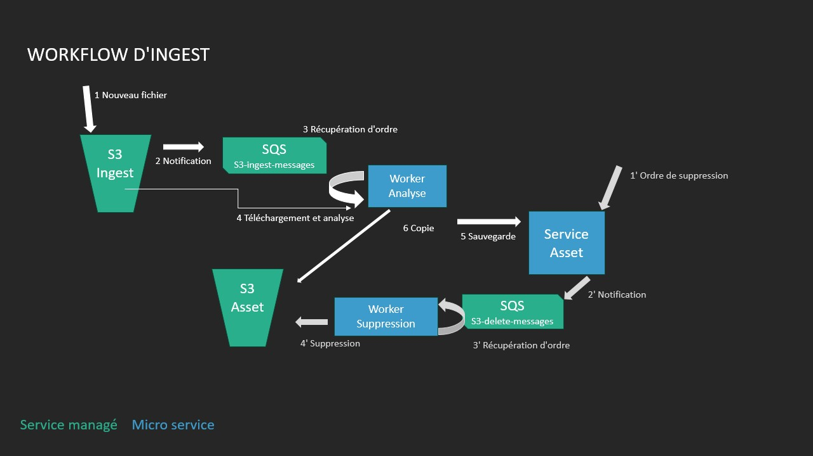

# TP WORKFLOW INGEST DE MÉDIA
Youssef Salamat
## I Introduction

Dans ce TP vous allez créer un **Workflow d'ingest** des fichiers wav.

Ce workflow est composé de plusieurs étapes :

- Les fichiers sont reçus sur un bucket S3 d'ingest.

- A la réception d'un fichier, le bucket S3 d'ingest envoie un événement sur une file SQS.

- Un worker d'analyse écoute cette file SQS. Lorsqu'un nouvel événement arrive, il télécharge le fichier dans un espace de travail puis il analyse le fichier. Si le résultat de l’analyse est conforme, il envoie les informations à un service HTTP asset, il copie ce fichier dans un autre bucket S3 d’archivage.

- Un service HTTP présente une API REST pour gérer des ressources ASSETS. Ce service HTTP peut supprimer des ressources et ordonner la suppression d'un fichier sur le bucket S3 d'archive.



S3 et SQS sont des services managés AWS qui seront simulés en local grâce à LocalStack un service exécuté sur Docker.

## II Installation

L'environnement de travail a déjà des outils installés :

- Python3
- Pip (Python package manager)
- Docker
- Git

**[virtualenv](https://virtualenv.pypa.io/en/latest/)**

Virtualenv (venv) permet de configurer des environnements Python isolés. Créez un virtualenv et installez les dépendances Python du projet :

```shell
python3 -m venv .venv
source .venv/bin/activate
pip install --upgrade pip
pip install -r requirements.txt
```
Le code de ce projet sera exécuté dans le virutalenv pour résoudre les dépendances Python. Dans tous nouveaux shells, vous pouvez activer le virualenv avec :

    source .venv/bin/activate

Le prompteur commence par (.venv) quand le virtualenv est activé.

**[LocalStack](https://github.com/LocalStack/LocalStack)**  

_LocalStack est disponible dans le virtualenv._

Lancez la commande :

```shell
    sudo su -
    source .venv/bin/activate
    localstack start -d
```

_Le service peut mettre un certain temps à démarrer car il doit télécharger l'image docker de LocalStack._

Vérifiez l’état des services LocalStack :

    source .venv/bin/activate

    localstack status services

**[AWS CLI](https://awscli.amazonaws.com/v2/documentation/api/latest/index.html)**

_AWS CLI est disponible dans le virtualenv._

Cet utilitaire permet d'interagir avec des ressources disponibles sur AWS comme les services managés. Dans ce TP _AWS CLI_ interagit avec les ressources de LocalStack.

Ajoutez ces variables dans un script bash `env.sh` pour configurer _AWS CLI_ avec LocalStack.

```shell
export AWS_ACCESS_KEY_ID="test"
export AWS_SECRET_ACCESS_KEY="test"
export AWS_DEFAULT_REGION="us-east-1"
alias awslocal='aws --endpoint-url=http://localhost:4566'
```  

__Dans la suite du TP, il faut remplacer la commande `aws` par `awslocal`__

Pour charger ces valeurs dans le terminal, utilisez la commande :

```shell
source env.sh
```

**Références et documentations**

[AWS CLI](https://awscli.amazonaws.com/v2/documentation/api/latest/index.html)

AWS SDK Python [BOTO3](https://boto3.amazonaws.com/v1/documentation/api/latest/index.html)

Le Framework Python [FastAPI](https://fastapi.tiangolo.com/)

La bibliothèque Python HTTP [requests](https://www.w3schools.com/python/module_requests.asp)

La bibliothèque d'analyse de wav [wavinfo](https://wavinfo.readthedocs.io/en/latest/command_line.html)

Le modèle de données fourni par wavinfo :

```python
{
    "fmt": {
        "audio_format": 1,
        "channel_count": 2,
        "sample_rate": 48000,
        "byte_rate": 288000,
        "block_align": 6,
        "bits_per_sample": 24
    },
    "data": {
            "byte_count": 1441434,
            "frame_count": 240239
        }
}
```

## III Les services managés AWS

**Référez-vous à la documentation AWS CLI**

**S3**


S3 (Simple Storage Service) stocke les fichiers sous forme d'objets dans un compartiment appelé bucket.

**Complétez la ligne de commande et créez les bucket S3 nommés `ingest` et `asset` avec s3api:**
awslocal s3api create-bucket --bucket ingest
awslocal s3api create-bucket --bucket asset


```shell
awslocal s3api ...
```

**Que retourne l'API ?**  

**Quelle sont les commandes AWS S3 pour :**
- Copier un fichier en local vers le bucket S3 ingest
- Listez des fichiers sur le bucket S3 ingest
- Supprimer un fichier sur le bucket S3 ingest

Des échantillons sont disponibles dans le dossier media/audio_(1-5).wav.

**SQS**

SQS est un service d'échange de messages.

**Complétez la ligne de commande et créez une nouvelle file SQS nommée `s3-ingest-messages` avec les attributs `file://configs/sqs-retention-config.json`:**

```shell
awslocal sqs create-queue ...
```  

**Quel est le retour de cette commande ?**  

Il faut configurer le bucket pour qu’il notifie la présence d’un nouveau fichier par cette file SQS.

**Complétez la ligne de commande et appliquez la configuration sur le bucket S3 `ingest` avec la configuration `file://configs/s3-notif-config.json`:**

```shell
awslocal s3api put-bucket-notification-configuration ...
```

## IV Workflow d'Ingest

**Configuration**

Créez le fichier `code/settings.py` et complétez les valeurs manquantes en avançant dans le TP.
```python
STACK_URL = "http://localhost:4566"
ASSET_URL = "http://localhost:8000"
SQS_INGEST = ""
SQS_DELETE = ""
```

**Backend API assets**

Le service HTTP assets `code/http_assets.py` présente l'API REST des ressources ASSETS. Ce service utilise le Framework Python FastAPI et génère une documentation automatiquement.

Exécutez la commande pour lancer le serveur (l'option --reload redémarre automatiquement le serveur à chaque modification du code source) :

```shell
uvicorn code.http_assets:app --reload
```

Accédez à l'API REST par le navigateur web.

**Quelles sont les routes proposées par l'API du service ?**

### Analyse de fichiers

Le worker d'analyse `code/worker_probe.py` détecte un message SQS sur la file `s3-ingest-messages`. Implémentez la logique métier du worker :

1/ Le worker télécharge depuis S3 le média à analyser (PART IV A).

2/ Ajoutez les règles de gestion dans l'analyse (PART IV B) :

- Un fichier doit avoir une fréquence d'échantillonnage de `48000` hz et une quantification de `24` bits pour être valide.

3/ Consolidez les informations issues de wavinfo avec celles attendues par le modèle de données ASSET (PART IV C) :

    - channel_count : int
    - frame_count : int
    - sample_rate : int
    - bits_per_sample : int
    - duration : str (calculée à partir du frame_count et du sample_rate)

4/ L'analyse est envoyée au service HTTP assets (PART IV D).

5/ Si l'analyse du fichier est valide, le fichier est copié sur le bucket S3 asset (PART IV E).
Exécutez la commande pour lancer le worker (le worker ne redémarre pas automatiquement lors des modifications du code source, il faut le relancer manuellement) :

```shell
python code/worker_probe.py
```  

Ajoutez tous les fichiers du répertoire `media` dans le bucket `s3://ingest/` pour déclencher des workflows.

**A la fin des workflows, listez les fichiers valides dans le bucket `assets` avec une commande awslocal s3.**

**Récupérez sur l'API du service HTTP assets toutes les analyses enregistrées.**

**Quels fichiers sont invalides et pourquoi sont-ils invalides ?**

## Suppression de fichiers

Créez une file SQS `s3-delete-messages` et compléter le fichier settings.py avec la valeur de `SQS_DELETE`.

**Complétez la ligne de commande et créez une nouvelle file SQS nommée `s3-delete-messages` avec les attributs `file://configs/sqs-retention-config.json`:**

```shell
awslocal sqs create-queue ...
```

Complétez le code du service HTTP assets `code/http_assets.py` pour envoyer un message de suppression sur la route `DELETE` (PART IV F).

Complétez le code du worker de suppression de fichier `code/worker_delete.py` (PART IV G).

(Utilisez la fonction `commons.dict_tojson` pour sérialiser le Message Body de sqs.send_messsage().)

Le message JSON d'initialisation de la suppression est de cette forme :

```json
{
    "file" : {
        "bucket" : "", < le nom du bucket S3
        "key" : "",  < le nom du fichier
    }
}
```

Exécutez la commande pour lancer le worker (le worker ne redémarre pas automatiquement lors des modifications du code source, il faut le relancer manuellement) :

```shell
python code/worker_delete.py
```

Supprimez un des assets enregistrés sur le service assets.

  **Quelle route est utilisée pour supprimer un asset sur le service HTTP ? Reportez les logs du worker et du service lors d'une suppression.**
